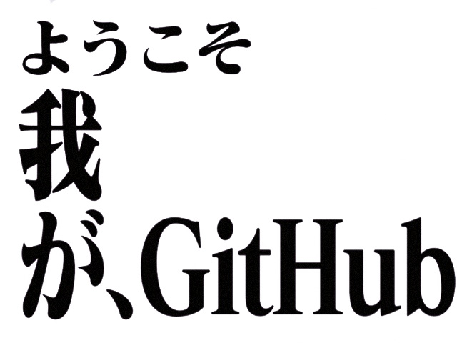

<link rel="stylesheet" type="text/css" href="./assets/eva.css">

<h1>其の壱、自己紹介</h2>
<ul>
    <li>西元2012年、初中偶然接触Visual Basic并开始了解编程开发</li>
    <li>西元2015年、本科考入西南交通大学软件工程系、自学各种语言、后成功混入研究生实验室打杂</li>
    <li>西元2019年、研究生考入George Washington University、师从Robert Pless研究算法</li>
    <li>西元2021年、加入蚂蚁集团</li>
    <li>西元2023年、开始接触开源项目项目开发</li>
</ul>

<h1>其の弐、語言把握</h1>

平时开发用Java和Python比较多，现在也开始尝试使用更多的语言，希望能在以后的学习中不断提升自己水平和技术。

<h1>其の参、GitHub状況</h1>

希望今年能多一些大型项目的PR

<h1>其の肆、Repo推薦</h1>

